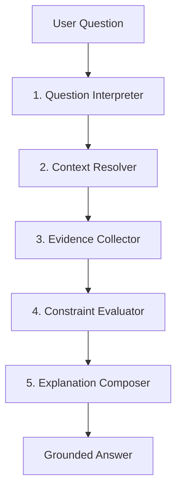

# Architecture Reference

## Core Philosophy
The Generic Application Intelligence Platform avoids the brittle "hardcoded analyzer" pattern (e.g., an agent just for billing, an agent just for visibility). Instead, it routes every problem as a mathematical equation: **Expected Behavior vs. Actual State**.

## The 5-Stage Pipeline

### 1. Question Interpreter
Filters out ambiguity, establishes intent (e.g., `technical_diagnosis`, `visibility_explanation`), and pulls out explicit identifiers (e.g., `BILL-123`).

### 2. Context Resolver
Finds where the rules live. It polls Tantivy, Qdrant, and Graph DBs to find the specific methods, configs, and SQL statements that govern the feature in question.

### 3. Evidence Collector
Fetches the factual reality. Retrieves actual logs, exact DB rows, or active config states necessary to prove what happened. *Note: All DB lookups are strictly evaluated under the user's RBAC scope.*

### 4. Constraint Evaluator
The diagnostic brain. It compares the expected conditions extracted in Step 2 against the reality from Step 3. Identifying the specific conditional failure (e.g., "discount > 10% was expected, actual discount was 8%").

### 5. Explanation Composer
Synthesizes the mechanical failure into a human-readable response tailored to the reader's technical capacity (Support operator vs. Lead Developer).

## Technology Stack

Our platform explicitly decouples compute and specialized retrieval tools for maximum scalability:
1. **Core Orchestrator:** Rust (Tower/Axum/Tokio)
2. **Abstract Syntax Parsing:** JavaParser (Java) + Tree-sitter (General purpose)
3. **Lexical Retrieval:** Tantivy (Rust Lucene alternative)
4. **Vector / Semantic Retrieval:** Qdrant
5. **Structural / Dependency traversal:** Cypher-compatible Graph (Neo4j/Memgraph)
6. **LLM Inference:** Local vLLM + Cloud API Fallbacks
